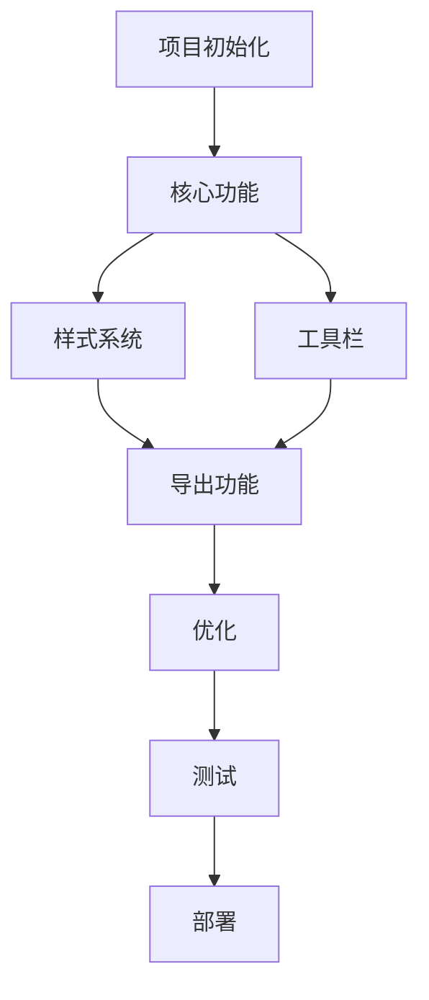

# Markdown 排版工具 - 实现任务清单

## 项目信息
- **项目名称**: Markdown 排版工具
- **技术栈**: React 19 + Vite 7 + Tailwind CSS 4 + Marked.js
- **预计工期**: 10-12天
- **创建日期**: 2025-09-10

## 任务清单

### 📋 第一阶段：项目初始化和基础架构

#### 1.1 项目初始化
- [ ] 使用 Vite 创建 React 项目
  ```bash
  npm create vite@latest markdown-formatter -- --template react
  cd markdown-formatter
  npm install
  ```
- [ ] 初始化 Git 仓库
- [ ] 创建 .gitignore 文件
- [ ] 配置 ESLint 和 Prettier

#### 1.2 安装核心依赖
- [ ] 安装 Markdown 解析器
  ```bash
  npm install marked@16
  ```
- [ ] 安装代码高亮库
  ```bash
  npm install prismjs
  ```
- [ ] 安装 Tailwind CSS
  ```bash
  npm install -D tailwindcss postcss autoprefixer
  npx tailwindcss init -p
  ```
- [ ] 安装其他工具库
  ```bash
  npm install lodash.debounce
  npm install classnames
  ```

#### 1.3 项目结构搭建
- [ ] 创建以下目录结构：
  ```
  src/
  ├── components/
  │   ├── Editor/
  │   ├── Preview/
  │   └── Toolbar/
  ├── hooks/
  ├── utils/
  ├── styles/
  │   └── themes/
  └── assets/
  ```
- [ ] 配置路径别名
- [ ] 设置环境变量

#### 1.4 配置 Tailwind CSS
- [ ] 配置 tailwind.config.js
- [ ] 创建自定义 CSS 变量
- [ ] 设置基础样式
- [ ] 配置响应式断点

---

### 🚀 第二阶段：核心功能开发

#### 2.1 编辑器组件开发
- [ ] 创建 Editor.jsx 组件
  - [ ] 实现 textarea 基础功能
  - [ ] 添加行号显示
  - [ ] 实现 Tab 键支持
  - [ ] 添加自动保存功能
- [ ] 创建快捷键支持
  - [ ] Ctrl/Cmd + B (粗体)
  - [ ] Ctrl/Cmd + I (斜体)
  - [ ] Ctrl/Cmd + K (链接)
  - [ ] Ctrl/Cmd + S (保存)
- [ ] 实现文本操作工具
  - [ ] 获取选中文本
  - [ ] 插入文本
  - [ ] 替换文本

#### 2.2 Markdown 解析器集成
- [ ] 创建 markdown-parser.js
- [ ] 配置 marked.js 选项
  ```javascript
  {
    breaks: true,
    gfm: true,
    headerIds: false,
    tables: true,
    smartLists: true
  }
  ```
- [ ] 实现自定义渲染器
  - [ ] 标题渲染器（添加锚点）
  - [ ] 代码块渲染器（语言标识）
  - [ ] 链接渲染器（新窗口打开）
  - [ ] 图片渲染器（懒加载）
- [ ] 添加扩展语法支持
  - [ ] 任务列表
  - [ ] 脚注
  - [ ] 数学公式（可选）

#### 2.3 预览组件开发
- [ ] 创建 Preview.jsx 组件
- [ ] 实现 HTML 安全渲染
- [ ] 添加滚动同步功能
- [ ] 实现打印样式优化
- [ ] 添加目录生成功能

#### 2.4 代码高亮集成
- [ ] 配置 Prism.js
- [ ] 加载语言包
  - [ ] JavaScript/TypeScript
  - [ ] Python
  - [ ] Java
  - [ ] HTML/CSS
  - [ ] JSON/YAML
  - [ ] Shell/Bash
- [ ] 实现代码块复制按钮
- [ ] 添加行号显示选项

#### 2.5 实时预览功能
- [ ] 实现防抖处理（300ms）
- [ ] 添加预览刷新指示器
- [ ] 处理大文档性能优化
- [ ] 实现增量更新

---

### 🎨 第三阶段：样式系统和主题

#### 3.1 主题变量系统
- [ ] 创建 CSS 变量架构
  ```css
  :root {
    --primary-color
    --text-color
    --bg-color
    --code-bg
    --border-color
    --font-family
    --font-size-base
    --line-height
  }
  ```
- [ ] 实现主题切换逻辑
- [ ] 添加主题持久化存储

#### 3.2 微信公众号主题
- [ ] 创建 wechat.css
- [ ] 样式特点：
  - [ ] 字号：16px
  - [ ] 行高：1.8
  - [ ] 颜色：#3f3f3f
  - [ ] 标题样式优化
  - [ ] 引用块样式
  - [ ] 代码块样式

#### 3.3 知乎主题
- [ ] 创建 zhihu.css
- [ ] 样式特点：
  - [ ] 字号：15px
  - [ ] 行高：1.7
  - [ ] 专业简洁风格
  - [ ] 卡片式代码块
  - [ ] 优化的表格样式

#### 3.4 掘金主题
- [ ] 创建 juejin.css
- [ ] 样式特点：
  - [ ] 技术风格
  - [ ] 深色代码块
  - [ ] 标签样式
  - [ ] 强调色处理

#### 3.5 通用样式优化
- [ ] 表格响应式处理
- [ ] 图片自适应
- [ ] 列表样式优化
- [ ] 引用块美化
- [ ] 分割线样式

---

### 🛠️ 第四阶段：工具栏和导出功能

#### 4.1 工具栏组件
- [ ] 创建 Toolbar.jsx
- [ ] 实现基础按钮组
  - [ ] 标题（H1-H6）
  - [ ] 粗体/斜体
  - [ ] 列表（有序/无序）
  - [ ] 引用
  - [ ] 代码块
  - [ ] 链接/图片
  - [ ] 表格
- [ ] 添加工具提示
- [ ] 实现快捷键提示

#### 4.2 快捷插入功能
- [ ] 实现 Markdown 语法插入
  ```javascript
  insertText(before, after, placeholder)
  ```
- [ ] 添加常用模板
  - [ ] 表格模板
  - [ ] 代码块模板
  - [ ] 任务列表模板
- [ ] 实现智能缩进

#### 4.3 导出功能
- [ ] HTML 导出
  - [ ] 生成完整 HTML
  - [ ] 内联样式选项
  - [ ] 复制到剪贴板
- [ ] Markdown 文件下载
  - [ ] 纯文本导出
  - [ ] 包含前置信息
- [ ] PDF 导出（可选）
  - [ ] 集成 html2pdf.js
  - [ ] 页面设置选项

#### 4.4 本地存储
- [ ] 创建 storage.js 工具
- [ ] 实现自动保存
  - [ ] 防抖处理（1秒）
  - [ ] 存储到 localStorage
  - [ ] 容量检测
- [ ] 历史记录功能
  - [ ] 保存最近 10 个版本
  - [ ] 版本切换
  - [ ] 清理旧版本

#### 4.5 文件操作
- [ ] 导入 Markdown 文件
- [ ] 拖拽上传支持
- [ ] 图片粘贴处理
- [ ] 文件大小限制

---

### ⚡ 第五阶段：优化和完善

#### 5.1 性能优化
- [ ] 实现虚拟滚动（长文档）
- [ ] 代码分割
  ```javascript
  const Preview = lazy(() => import('./Preview'))
  ```
- [ ] 懒加载优化
  - [ ] 图片懒加载
  - [ ] 语言包按需加载
- [ ] 内存优化
  - [ ] 及时清理定时器
  - [ ] 解绑事件监听
  - [ ] 限制最大字符数

#### 5.2 响应式设计
- [ ] 移动端布局适配
  - [ ] 编辑器/预览切换
  - [ ] 工具栏折叠
  - [ ] 手势支持
- [ ] 平板适配
- [ ] 小屏幕优化

#### 5.3 用户体验优化
- [ ] 添加加载状态指示
- [ ] 错误提示优化
- [ ] 操作反馈
  - [ ] 保存成功提示
  - [ ] 复制成功提示
  - [ ] 导出完成提示
- [ ] 键盘导航支持

#### 5.4 错误处理
- [ ] 全局错误边界
- [ ] 解析错误处理
- [ ] 网络错误处理
- [ ] 存储配额处理
- [ ] 降级方案

#### 5.5 测试
- [ ] 单元测试
  - [ ] 工具函数测试
  - [ ] 组件测试
- [ ] 集成测试
  - [ ] 编辑预览联动
  - [ ] 导入导出流程
- [ ] 浏览器兼容性测试
  - [ ] Chrome
  - [ ] Firefox
  - [ ] Safari
  - [ ] Edge

---

### 📦 第六阶段：构建和部署

#### 6.1 构建配置
- [ ] 优化 vite.config.js
- [ ] 配置环境变量
- [ ] 设置代码分割
- [ ] 压缩优化

#### 6.2 部署准备
- [ ] 创建生产构建
- [ ] 静态资源优化
- [ ] 配置 CDN
- [ ] 设置缓存策略

#### 6.3 CI/CD 配置
- [ ] GitHub Actions 配置
- [ ] 自动化测试
- [ ] 自动化部署
- [ ] 版本管理

---

## 技术要点和注意事项

### 安全性
- ⚠️ XSS 防护：使用 DOMPurify 净化用户输入
- ⚠️ CSP 配置：设置内容安全策略
- ⚠️ 敏感信息：避免存储敏感数据

### 性能指标
- 📊 首次加载时间 < 2s
- 📊 输入延迟 < 100ms
- 📊 预览刷新 < 300ms
- 📊 包体积 < 300KB (gzip)

### 兼容性要求
- ✅ Chrome 90+
- ✅ Firefox 88+
- ✅ Safari 14+
- ✅ Edge 90+
- ✅ 移动端浏览器

### 代码规范
- 📝 使用 ESLint 规则
- 📝 遵循 React 最佳实践
- 📝 组件单一职责
- 📝 合理使用 Hooks

---

## 依赖关系图



---

## 时间线

| 阶段 | 预计时间 | 关键交付物 |
|-----|---------|-----------|
| 第一阶段 | 1-2天 | 项目框架搭建完成 |
| 第二阶段 | 3-4天 | 核心编辑和预览功能 |
| 第三阶段 | 2-3天 | 完整的主题系统 |
| 第四阶段 | 2天 | 工具栏和导出功能 |
| 第五阶段 | 1-2天 | 优化和测试 |
| 第六阶段 | 1天 | 部署上线 |

---

## 风险管理

### 技术风险
- **风险**: Markdown 解析性能问题
  - **缓解**: 使用 Web Worker 处理
- **风险**: 大文件处理卡顿
  - **缓解**: 实现虚拟滚动和分片处理

### 进度风险
- **风险**: 主题样式调试耗时
  - **缓解**: 先实现一个主题，其他迭代开发
- **风险**: 浏览器兼容性问题
  - **缓解**: 尽早进行兼容性测试

---

## 后续迭代计划

### v1.1 功能增强
- [ ] 协同编辑功能
- [ ] 云端存储
- [ ] 插件系统
- [ ] 更多导出格式

### v1.2 平台扩展
- [ ] Electron 桌面版
- [ ] VS Code 插件
- [ ] Chrome 扩展

### v2.0 高级功能
- [ ] AI 写作助手
- [ ] 模板市场
- [ ] 团队协作
- [ ] 版本控制

---

## 项目管理

### 每日任务跟踪
使用此清单跟踪每日进度，完成的任务打勾 ✓

### 问题记录
记录开发过程中遇到的问题和解决方案

### 代码审查清单
- [ ] 代码风格一致性
- [ ] 注释完整性
- [ ] 性能优化
- [ ] 安全性检查
- [ ] 测试覆盖率

---

## 联系和支持

- **项目负责人**: [填写]
- **技术支持**: [填写]
- **文档地址**: /docs
- **问题反馈**: [GitHub Issues]

---

*最后更新时间: 2025-09-10*